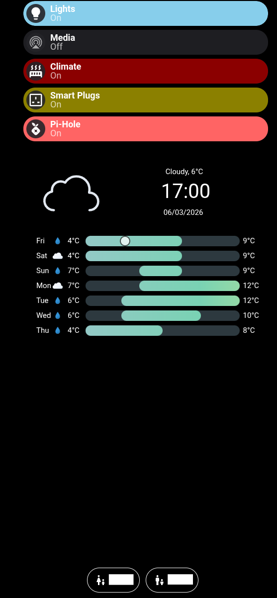
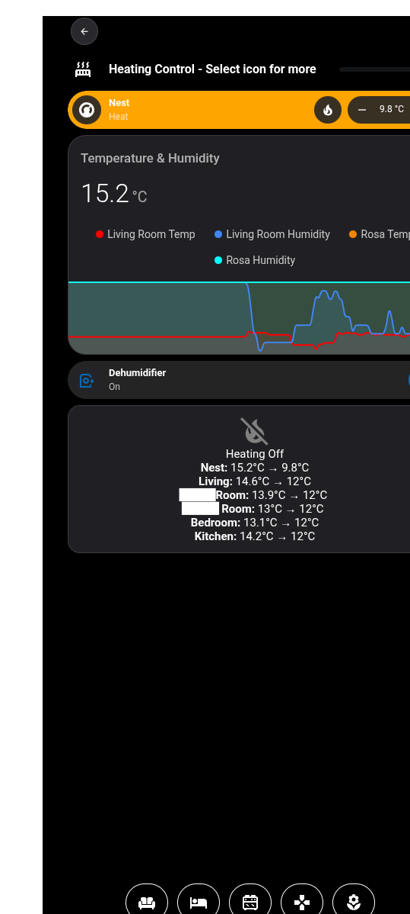
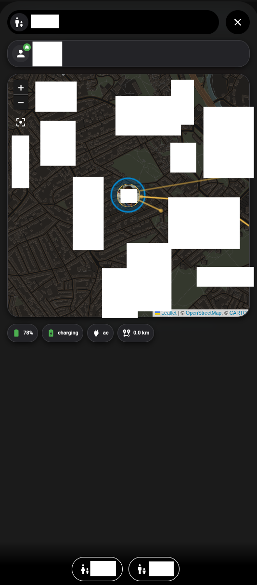

# 📸 Project Gallery

Click the sections below to expand the screenshots of the interface.

---

  
<b>📱 Main Dashboard (Mobile Optimized)</b>

  

    
  

  
<b>💡 Lights Control</b>

  

    
  

  
<b>🔥 Heating & Climate System</b>

  

    
  

  
<b>🚫 Pi-hole Infrastructure</b>

  

    
  

  
<b>✨ Sample Dashboard Popups</b>

  

    
  

  
<b>👤 User Profile (Privacy Edited)</b>

  

    
  

---
[← Back to Main README](../README.md)
